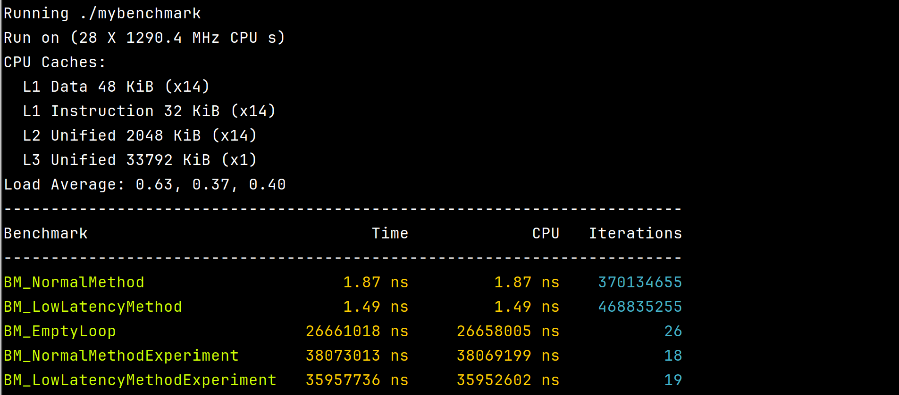

# StrictNegateNumber Benchmark

A tiny micro‑benchmark comparing two ways to negate a floating‑point number:

- **NormalMethod**  
  Uses `-std::abs(number)`, calling into the standard library and performing a branch.

- **LowLatencyMethod**  
  Flips the sign bit in place via a bitwise OR on the IEEE‑754 representation.  
  This avoids function calls, branches, and extra math instructions—minimizing instruction count and data dependencies.

## Why “Low‑Latency”?

Modern high‑performance code often needs to guarantee the shortest possible path through the CPU’s pipelines.  
By manipulating the sign bit directly:

1. **No library call** (`std::abs` is inlined only when optimizations allow).  
2. **No conditional flow** — branches can mispredict and stall the pipeline.  
3. **Single instruction** to flip the bit, reducing overall latency.

## Results (on 28 × 800 MHz cores)

|Benchmark | Time per call | Speedup |
| --------- | ------------- | ------- |
|BM_NormalMethod | 1.87 ns | 1.00× |
|BM_LowLatencyMethod | 1.49 ns | 1.25× |
|BM_EmptyLoop | 26.65 ms | --- |
|BM_NormalMethodExperiment (10 M) | 38.06 ms | 1.00× |
|BM_LowLatencyMethodExperiment (10 M) | 35.95 ms | 1.22× |

